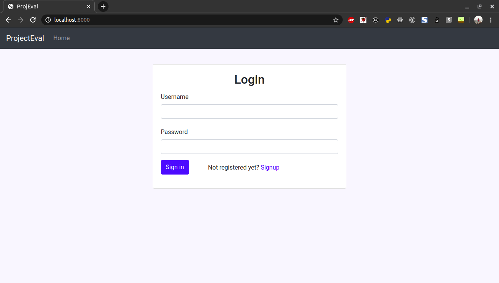
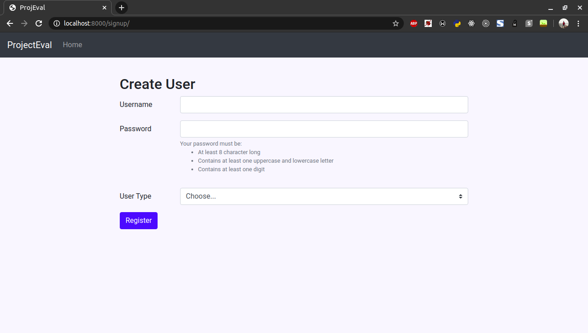
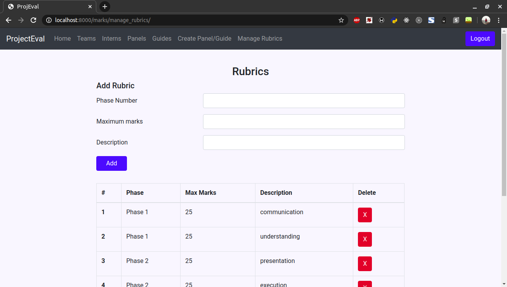
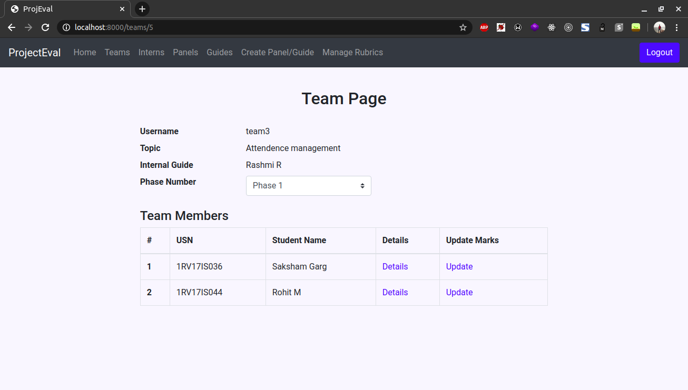
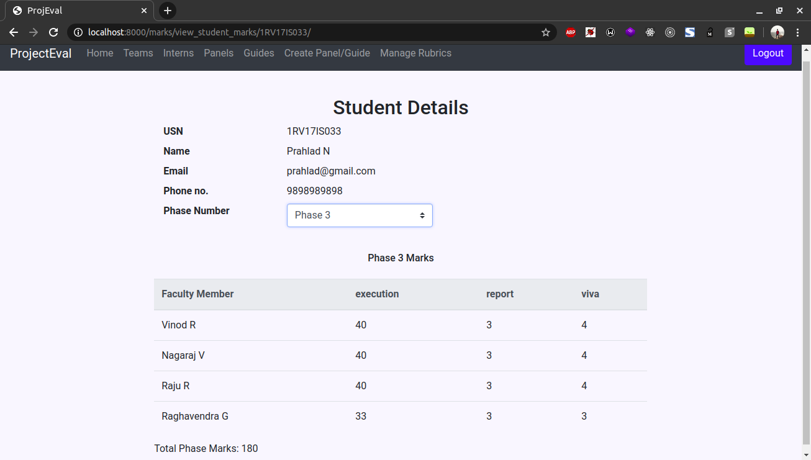
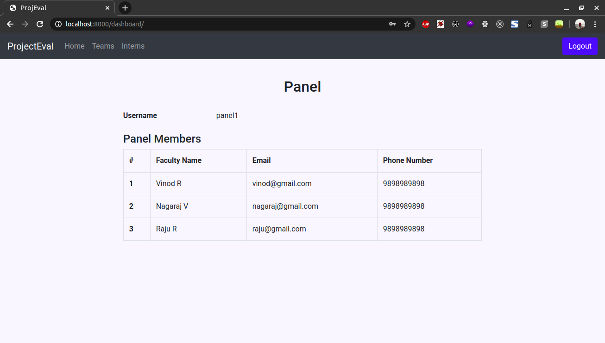

# 8th semester project evaluation portal

This application is used by guides and faculties present in panel to evaluate 8th semester project of interns and teams comprising of students according to the specified rubrics.

**This project implements Mulitple User Types in Django**

## Technologies used

- Python
- Django
- MySQL database
- Javascript
- Bootstrap
- HTML

## Installing locally

- Create python virtual environment and activate it
- Execute `pip3 install Django mysqlclient`
- Create database in MySQL called `project_eval`
- Run migations by executing `python3 manage.py migrate`
- Start the server by executing `python3 manage.py runserver`

Reference:
https://www.digitalocean.com/community/tutorials/how-to-create-a-django-app-and-connect-it-to-a-database

## Screenshots

1. Login Page
   

2. User Creation Page
   

3. Rubrics Page
   

4. Team Page
   

5. Student Details Page
   

6. Panel Page
   
